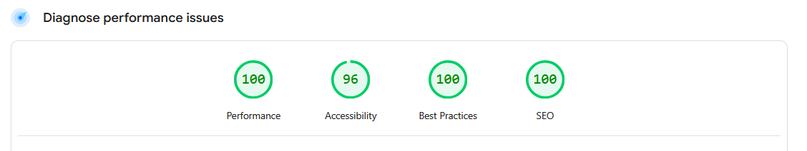

# Jakub Szamotulski | Fullstack Developer Portfolio

Welcome to my personal portfolio website! This project showcases my skills, experience, and projects as a Fullstack Developer and Software Engineering student at the University of Strathclyde. Built with Next.js, React, and Tailwind CSS, the site is designed for speed, accessibility, and modern web standards.

## 🚀 Features

- **Responsive Design:** Optimised for all devices and screen sizes.
- **Animated UI:** Smooth transitions and interactive elements using Framer Motion and Tailwind.
- **Projects & Experience:** Detailed sections for my work, certifications, and testimonials.
- **SEO & Accessibility:** Structured data, meta tags, and high-contrast design for best practices.
- **Performance:** Fast load times and efficient asset handling.

## 🛠️ Tech Stack

- Next.js
- React
- TypeScript
- Tailwind CSS
- Framer Motion
- Embla Carousel

## 📈 Lighthouse Scores

This portfolio is optimized for performance, accessibility, and SEO. Here are my latest Lighthouse scores:

### Mobile Lighthouse Report

### Desktop Lighthouse Report

**Tested on mobile and desktop using Chrome Lighthouse.**
